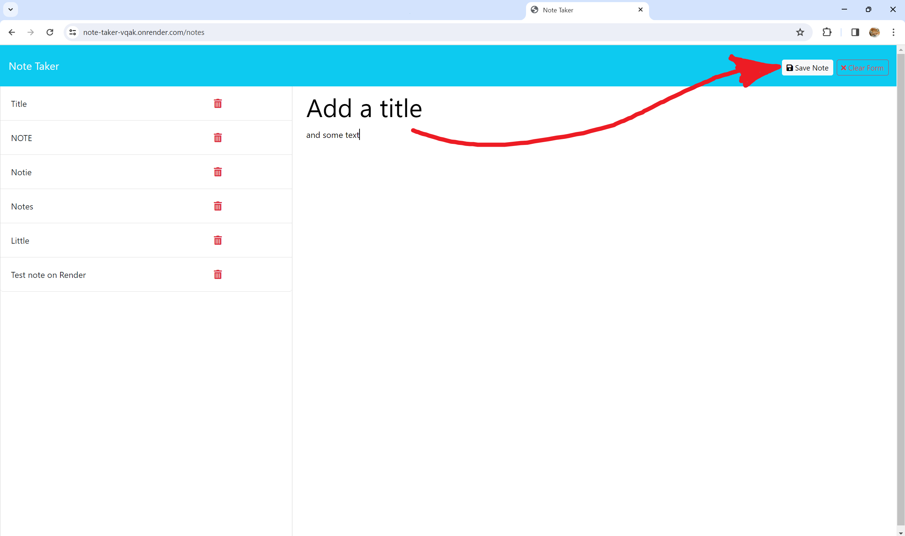

# note-taker

## Description

The note taker application was made to experiment with express.js. The challenge, for the most part, was simply getting the routes set up. The application itself was made for easier note-taking, due to the simple nature of the program.

## Table of Contents 

If your README is long, add a table of contents to make it easy for users to find what they need.

- [Installation](#installation)
- [Usage](#usage)
- [Credits](#credits)
- [License](#license)
- [Questions](#questions)

## Installation

No installation needed! Just a link:
https://note-taker-vqak.onrender.com

## Usage

Running it on render makes it more convenient to use, but here is a step by step guide on how the application works there.

Once the link is opened, you'll find yourself on the starting page. Just click the 'get started' button to go to the main page.

Here is the main page. Here you will make notes, save them, delete them, etc.
To make a note, simply add a title and some note content, and the 'save note' button should appear. Click it, and it'll show up in the sidebar.

If you want to delete a note, just hit the trash can button, and it will be deleted from the database file holding the information.

If you want to review your other notes, just click on them from the sidebar and they'll show up on the right side of the screen.

## License

https://choosealicense.com/licenses/mit/

MIT License

    Copyright (c) 2024 Paula 'Fel' Gonzalez
    
    Permission is hereby granted, free of charge, to any person obtaining a copy
    of this software and associated documentation files (the "Software"), to deal
    in the Software without restriction, including without limitation the rights
    to use, copy, modify, merge, publish, distribute, sublicense, and/or sell
    copies of the Software, and to permit persons to whom the Software is
    furnished to do so, subject to the following conditions:
    
    The above copyright notice and this permission notice shall be included in all
    copies or substantial portions of the Software.
    
    THE SOFTWARE IS PROVIDED "AS IS", WITHOUT WARRANTY OF ANY KIND, EXPRESS OR
    IMPLIED, INCLUDING BUT NOT LIMITED TO THE WARRANTIES OF MERCHANTABILITY,
    FITNESS FOR A PARTICULAR PURPOSE AND NONINFRINGEMENT. IN NO EVENT SHALL THE
    AUTHORS OR COPYRIGHT HOLDERS BE LIABLE FOR ANY CLAIM, DAMAGES OR OTHER
    LIABILITY, WHETHER IN AN ACTION OF CONTRACT, TORT OR OTHERWISE, ARISING FROM,
    OUT OF OR IN CONNECTION WITH THE SOFTWARE OR THE USE OR OTHER DEALINGS IN THE
    SOFTWARE.

## Questions

If you have any questions, please contact me through either:
My GitHub: https://github.com/gonz951

Or email: felgonzalez951@gmail.com
